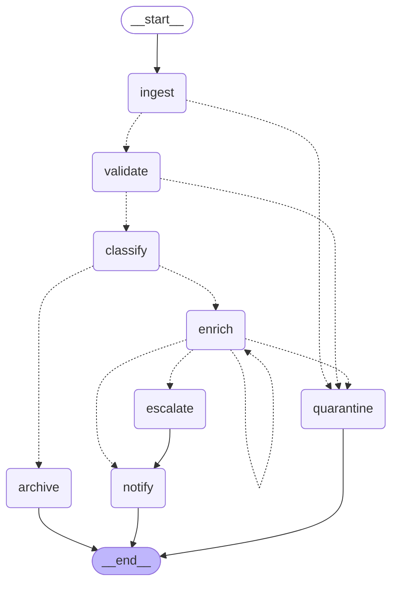

# iot-agent

A small LangGraph state machine that triages the IoT telemetry flowing through
the Nurol platform. `sender-service` publishes readings to RabbitMQ; this agent
picks each one up, decides how alarming it is, and drives it to one of four
terminal states: **archived**, **notified**, **escalated** or **quarantined**.

The nodes are ordinary Python functions with no LLM calls, so the machine is
deterministic and the whole suite runs offline.

## The machine



| Node | What it does | Where it can go |
| --- | --- | --- |
| `ingest` | Parses the body, unwrapping the `CustomMessage` envelope | `validate`, `quarantine` |
| `validate` | Required fields, known metric, plausible value | `classify`, `quarantine` |
| `classify` | Applies the metric thresholds to get a severity | `archive`, `enrich` |
| `enrich` | Looks up site/owner for the device; retries transient failures | `enrich`, `escalate`, `notify`, `quarantine` |
| `escalate` | Builds a P1 alert with a 15 minute ack deadline | `notify` |
| `notify` | Hands the alert to the outbound sink | `END` |
| `archive` | Terminal state for healthy readings | `END` |
| `quarantine` | Terminal state for anything unusable | `END` |

Two details worth knowing:

- `errors` and `trail` use append reducers, so a retried message keeps its full
  history instead of the last attempt overwriting the earlier ones.
- `route_after_enrich` branches on whether `enrichment` was filled in, not on
  whether `errors` is empty — an append-only error list would otherwise keep a
  message that eventually succeeded stuck in the retry loop.

## Thresholds

`config.py` holds the rules. `direction` says which way is bad, so a battery
alarms when it drops *below* the limit while a temperature alarms above it.

| Metric | Unit | Warning | Critical | Direction |
| --- | --- | --- | --- | --- |
| temperature | C | 60 | 85 | above |
| vibration | mm/s | 7.1 | 11.2 | above |
| pressure | bar | 8 | 10 | above |
| battery | % | 25 | 10 | below |

## Running it

```bash
cd iot-agent
python -m venv .venv && source .venv/bin/activate
pip install -r requirements-dev.txt

PYTHONPATH=src python -m iot_agent --demo                 # the sample messages
PYTHONPATH=src python -m iot_agent --mermaid              # print the diagram
PYTHONPATH=src python -m iot_agent --flaky 2 --message \
  '{"device_id":"pump-01","metric":"temperature","value":91}'   # retry loop
pytest
```

`--demo` walks one message down every path:

```
pump-01 temperature=41.2    archived     ingest > validate > classify > archive
press-07 vibration=8.4      notified     ingest > validate > classify > enrich > notify
pump-01 temperature=91.0    escalated    ingest > validate > classify > enrich > escalate > notify
press-07 humidity=12.0      quarantined  ingest > validate > quarantine
```

## Using it from code

```python
from iot_agent import build_graph, new_state

graph = build_graph(sink=my_pager)      # rules, enricher, sink, max_retries, checkpointer
result = graph.invoke(new_state('{"device_id":"pump-01","metric":"temperature","value":91}'))
result["status"]    # 'escalated'
result["trail"]     # ['ingest', 'validate', 'classify', 'enrich', 'escalate', 'notify']
```

Every dependency has a working default, so `build_graph()` on its own is
runnable. Pass a checkpointer (`InMemorySaver`, or a Postgres one later) plus a
`thread_id` and the run becomes resumable and inspectable via
`graph.get_state(config)`.

## RabbitMQ bridge

`consumer.py` binds its **own** queue (`iot_agent_queue`) to the existing
`message_exchange` topic exchange with the same `message_routingKey`. Sharing
`message_queue` with `receiver-service` would make the two compete for
messages; a separate binding means both see every reading.

```bash
pip install pika
RABBITMQ_HOST=localhost RABBITMQ_PORT=5672 PYTHONPATH=src python -m iot_agent --consume
```

Broker settings come from `RABBITMQ_HOST`, `RABBITMQ_PORT`, `RABBITMQ_USERNAME`,
`RABBITMQ_PASSWORD`, `RABBITMQ_QUEUE`, `RABBITMQ_EXCHANGE` and
`RABBITMQ_ROUTING_KEY`, defaulting to the in-cluster values the Java services
already use.

## Deploying

`k8s/iot-agent.yml` is deliberately **not** in the repo-root `k8s/` folder: the
pipeline runs `kubectl apply -f k8s/`, so applying it before
`reverendray/iot-agent` exists in the registry would leave a pod in
`ImagePullBackOff`. To ship it, add a build-and-push step for `iot-agent/Dockerfile`
to `.github/workflows/workflow.yml` and then move the manifest up into `k8s/`.

## Next steps

- Swap `registry_enricher` for a real call to `department-service` / `employee-service`
  (raise `TransientEnrichmentError` on a timeout and the retry loop already covers it).
- Replace `logging_sink` with the actual notification channel.
- Load thresholds from `config-server` instead of `config.py`.
- Move to a persistent checkpointer so in-flight messages survive a restart.
